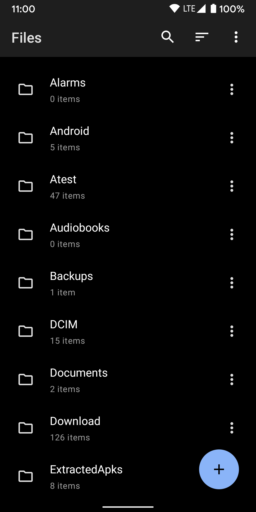
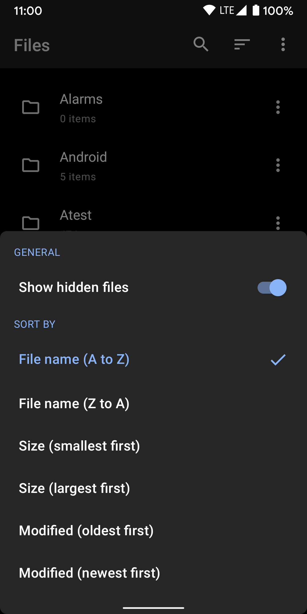
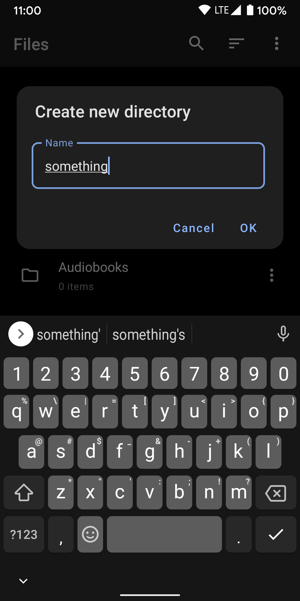
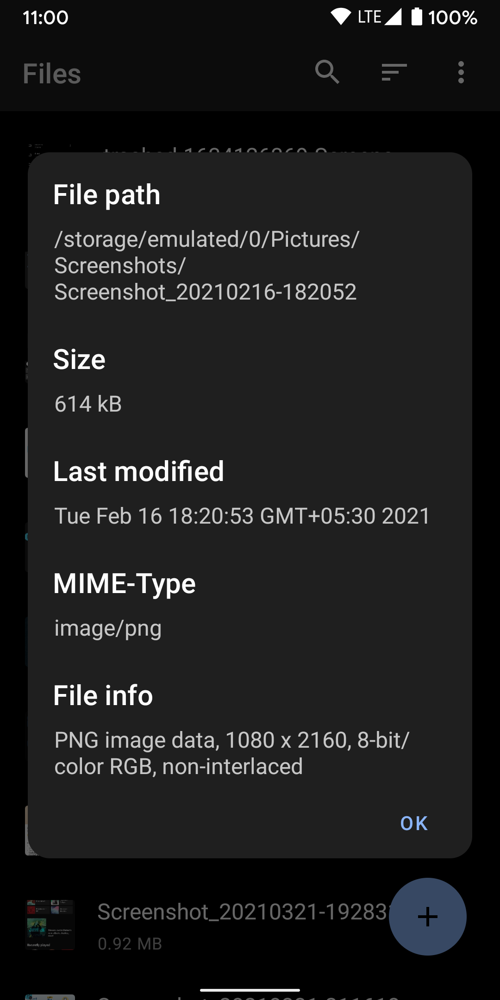
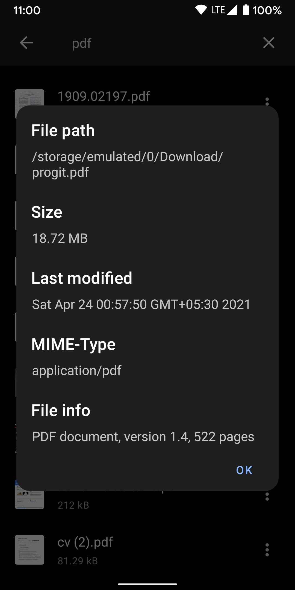
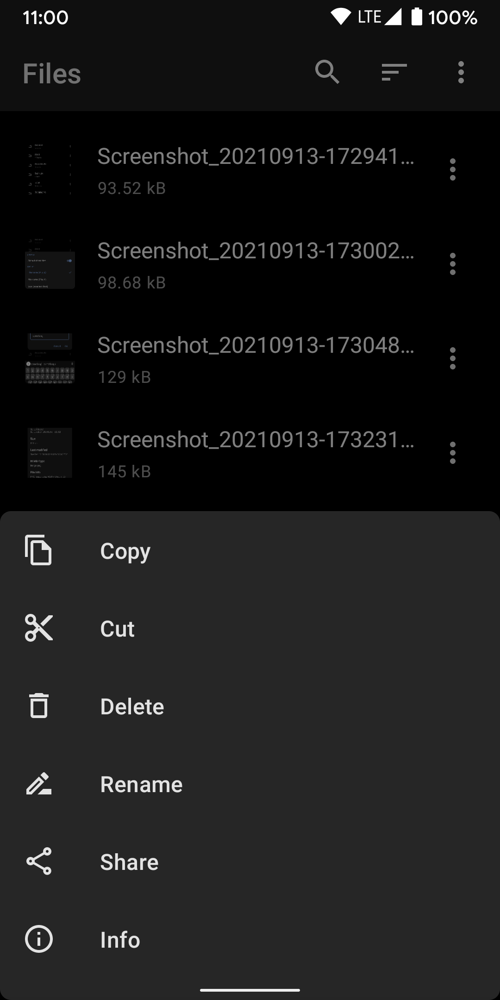

# Magic Files

The most advanced and personal file manager for Android. It allows you to manage all your files and folders. Magic Files supports all the basic file management operations, such as browse, analyze, search, move, and delete files. It also has a number of advanced features, such as file encryption, file compression, and file sharing.

A great file manager for anyone who wants a powerful and user-friendly tool for managing their files. It is especially useful for people who have a lot of files and folders, as it can help you organize them quickly and easily.

The only file manager that detects file-type based on its magic number using libmagic

Features:

* Magic number based file-type detection
* Powerful file manager
* Manage all your files and folders
* Basic and advanced file management operations
* File sharing
* File encryption (Coming soon)
* File compression (Coming soon)

Benefits:

* Powerful and user-friendly
* Organizes your files quickly and easily
* Handles large files and folders
* Keeps your files safe and secure
* Share files with others easily

Currently available on the Play Store.

## Screenshots

    
    
    
    
    
    

## Contributing Bug reports

Use either GitLab or GitHub for filing a bug report.
Please search the existing issues for your bug and create a new one if the issue is not yet tracked!

GitLab:
https://gitlab.com/karthek/MagicFiles/-/issues

GitHub:
https://github.com/karthek-git/MagicFiles/issues

## Joining the Beta

Want to live life on the bleeding edge and help out with testing?

You can subscribe to Magic Files Beta releases here:
https://play.google.com/apps/testing/com.karthek.android.s.files2

For stability, stick with the public releases.

## Contributions

If you've found a bug in this app, please file an issue.

Patches are encouraged and may be submitted by forking this project and
submitting a pull request. Since this project is still in its very early stages,
if your change is substantial, please raise an issue first to discuss it.

## Help

For troubleshooting and questions, please write to me at mail@karthek.com

Google Play and the Google Play logo are trademarks of Google LLC.
